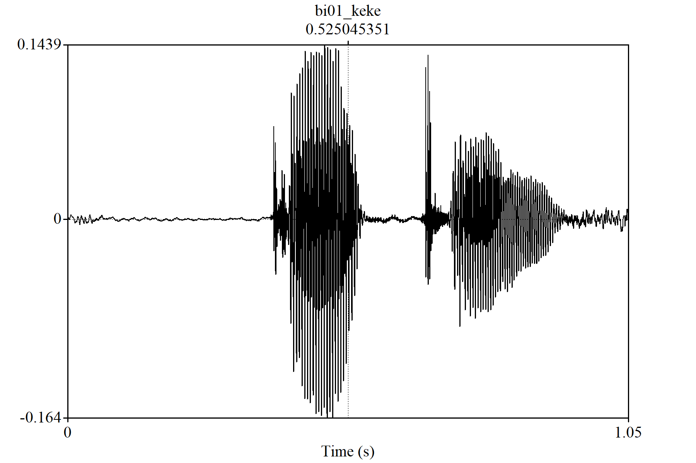
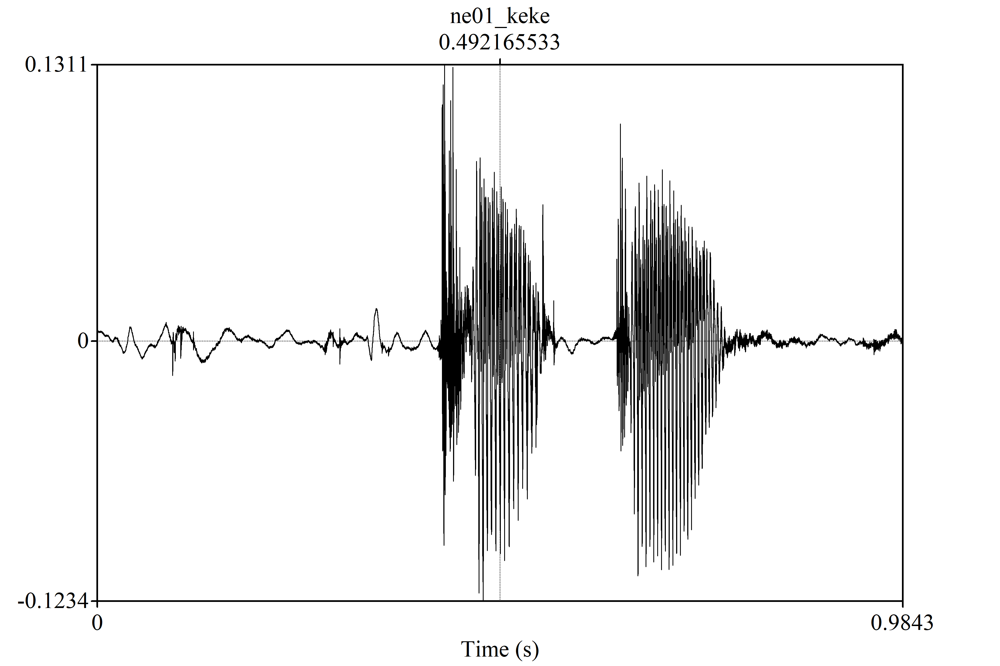

**Author**: Valeria Bedoya   
**Date**: Last update: `r Sys.time()`


# Overview

In this PA4 assignment, I had to segment 270 different audios of one L2 Spanish Learner
and a bilingual with L1 Spanish and L2 English. What we learned from the past classes
was how to segment and find the VOT for the oclusives p,t,k. We saw that when learners with
L1 english L2 spanish produced the oclusive sounds they had longer VOTs for the the crosslinguistic effect. For this reason the hipothesis here is that in the graphics we will eivdence this.Depending on the learner’s proficiency and amount of exposure to Spanish, we would also expect some variability in how closely their productions approximate Spanish-like VOT patterns.

# Prep

## Libraries

```{r}

```

## Load data

```{r}
#| label: load-data 

data_path <- "C:/Users/lb1181/Desktop/pa_4/data"
files <- list.files(data_path, pattern = "\\.csv$", full.names = TRUE)

print("Archivos detectados:")
print(files)

data_list <- lapply(files, read.csv)

dat <- do.call(rbind, data_list)

print("Primeras filas:")
head(dat)
```

## Tidy data

```{r}
#| label: tidy-data

dat$fileID <- as.character(dat$fileID)

dat$participant <- sub("(^[a-z]+[0-9]+).*", "\\1", dat$fileID)

dat$group <- ifelse(grepl("^bi", dat$participant), "bilingual", "learner")

dat$item <- sub("^[a-z]+[0-9]+_", "", dat$fileID)     
dat$item <- gsub("[0-9]+$", "", dat$item)    

dat$repetition <- as.numeric(gsub(".*([0-9]+)$", "\\1", dat$fileID))

dat <- dat[, c("fileID", "participant", "group", "item", "repetition", 
               "f1", "f2", "vot", "notes")]
head(dat)

```

# Analysis

## Descriptives

```{r}
#| label: descriptive-stats
library(knitr)
desc_group <- data.frame(
  group = unique(dat$group),
  vot_mean = tapply(dat$vot, dat$group, mean, na.rm = TRUE),
  vot_sd   = tapply(dat$vot, dat$group, sd,   na.rm = TRUE),
  f1_mean  = tapply(dat$f1,  dat$group, mean, na.rm = TRUE),
  f1_sd    = tapply(dat$f1,  dat$group, sd,   na.rm = TRUE),
  f2_mean  = tapply(dat$f2,  dat$group, mean, na.rm = TRUE),
  f2_sd    = tapply(dat$f2,  dat$group, sd,   na.rm = TRUE)
)
kable(desc_group, caption = "Descriptive statistics by group")

desc_item <- aggregate(cbind(vot,f1,f2) ~ item, dat, mean)
kable(desc_item, caption = "Descriptive statistics by item")

```

## Visualization

```{r}
#| label: plots 
#| fig.retina: 2

library(ggplot2)

#Bilingual speakers will show shorter VOT values than learners 

ggplot(dat, aes(x = group, y = vot, fill = group)) +
  geom_boxplot(alpha = 0.7) +
  labs(
    title = "VOT por grupo (bilingual vs learner)",
    x     = "Group",
    y     = "VOT (ms)"
  ) +
  theme_minimal(base_size = 14) +
  theme(legend.position = "none")

#The VOT are not just longer, but they show more variability

ggplot(dat, aes(x = group, y = vot, color = group)) +
  geom_jitter(width = 0.15, alpha = 0.5) +
  stat_summary(fun = mean, geom = "point",
               size = 5, color = "black") +
  labs(
    title = "Distribución individual de VOT por grupo",
    x     = "Group",
    y     = "VOT (ms)"
  ) +
  theme_minimal(base_size = 14) +
  theme(legend.position = "none")

#The VOT also varies depending on the vowel 

ggplot(dat, aes(x = item, y = vot)) +
  geom_boxplot(fill = "lightgray") +
  labs(
    title = "VOT por ítem (‘kaka’ vs ‘keke’)",
    x     = "Item",
    y     = "VOT (ms)"
  ) +
  theme_minimal(base_size = 14)

#Image from bilingual 
#| label: praat-bilingual
#| echo: false
#| out.width: "80%"


#Image from learner
#| label: praat-learner
#| echo: false
#| out.width: "80%"


```

## Hypothesis test

```{r}
#| label: stats

t_test_result <- t.test(vot ~ group, data = dat)
t_test_result

model <- lm(vot ~ group + item, data = dat)
summary(model)

```

# Conclusion

In this assignment, I predicted (H1) that bilingual speakers would produce shorter VOT values than the L2 learner, and (H2) that VOT would vary depending on the phonetic characteristics of each item. Both predictions were supported by the data.

The descriptive plots clearly showed that the learner consistently produced longer VOT across nearly all items, while the bilingual speaker displayed the shorter VOT values expected in Spanish. These differences were confirmed statistically: the Welch t-test revealed a large and highly significant difference between the groups (bilingual M = 21.96 ms vs. learner M = 35.85 ms, p < .0001). The 95% confidence interval indicated that the learner’s VOT was approximately 10–17 ms longer on average. This strongly supports H1 and aligns with the cross-linguistic expectation that L1 English speakers maintain longer VOT when producing Spanish voiceless stops.I wish I had been able to show the difference of 10 to 17 ms in the pictures from Praat, but I couldn't do the image with the texgrid and the segmentation. 

The linear model further demonstrated that group was a strong predictor of VOT even after accounting for item-level variation (β = 13.89, p < .0001). Several items also showed significant effects, indicating that vowel quality and consonantal context influenced the timing between the burst and the onset of voicing. This supports H2 and is consistent with known coarticulatory patterns, especially the influence of high vowels such as /i/ and /u/.I guess the variability depends on the learners' exposure or level, but I think this would require to have control for that in the data. That is my guessing.

Overall, the analysis confirmed both hypotheses: bilingual speakers produced Spanish-like short VOT values, while the L2 learner produced longer, English-like values; and VOT varied across items due to segmental and vocalic context. Through this process I learned to segment data, extract acoustic measurements with Praat, and generate reproducible analyses in R, and I observed firsthand how phonetic patterns reflect linguistic experience and cross-linguistic influence.

Note: I will never wait until the last minute to complete these tasks again, because it is really frustrating when things don’t work and you know you could have started earlier. Still, I learned a lot from these PA assignments. When I was in school, I completed a technician program in electronics and had to do some programming. I used to enjoy it because it felt like solving cases or little mysteries. That is exactly what I liked the most here: trying to understand what was happening and figuring out how to fix it.

Getting the plots and graphics at the end made me feel like a very small version of a researcher, and that part was actually exciting. The part I hated the most was the issue with my computer — just when I finally felt like I understood everything, my laptop broke. Even though I technically didn’t need it, it made me feel like I did, and that added a lot of stress.

</br></br>
