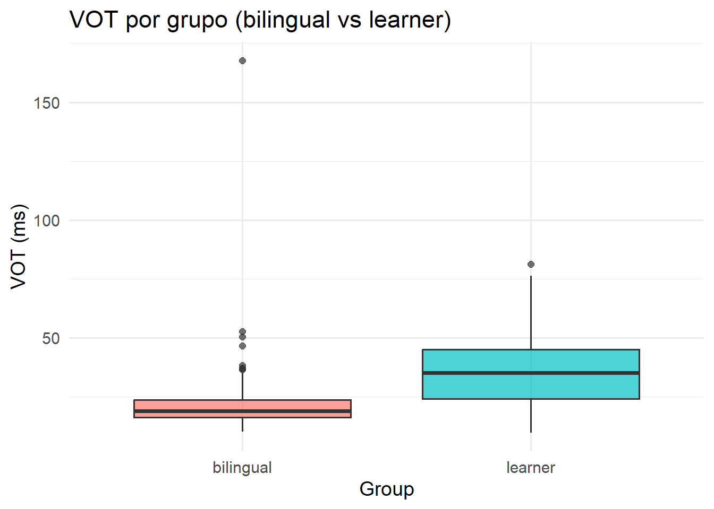
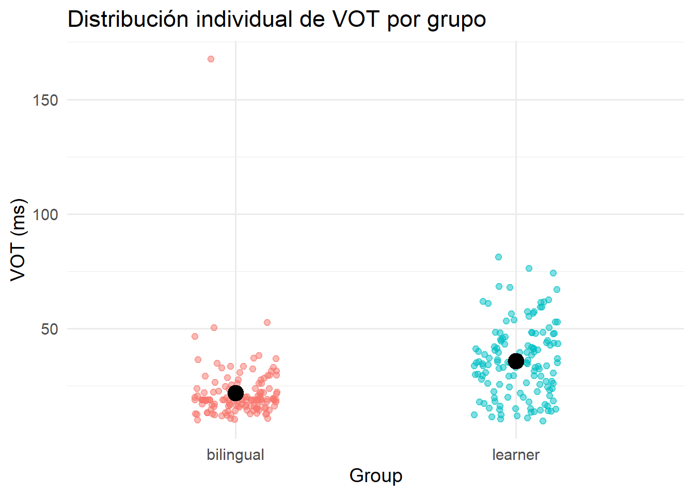
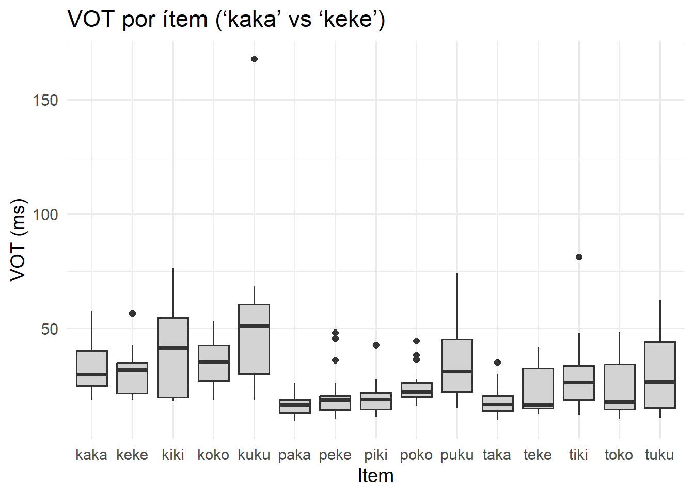

Programming assignment 4
================

**Author**: Valeria Bedoya  
**Date**: Last update: 2025-11-26 14:54:04.632541

# Overview

In this PA4 assignment, I had to segment 270 different audios of one L2
Spanish Learner and a bilingual with L1 Spanish and L2 English. What we
learned from the past classes was how to segment and find the VOT for
the oclusives p,t,k. We saw that when learners with L1 english L2
spanish produced the oclusive sounds they had longer VOTs for the the
crosslinguistic effect. For this reason the hipothesis here is that in
the graphics we will eivdence this.Depending on the learner’s
proficiency and amount of exposure to Spanish, we would also expect some
variability in how closely their productions approximate Spanish-like
VOT patterns.

# Prep

## Libraries

## Load data

``` r
data_path <- "C:/Users/lb1181/Desktop/pa_4/data"
files <- list.files(data_path, pattern = "\\.csv$", full.names = TRUE)

print("Archivos detectados:")
```

    ## [1] "Archivos detectados:"

``` r
print(files)
```

    ## [1] "C:/Users/lb1181/Desktop/pa_4/data/bi01.csv"
    ## [2] "C:/Users/lb1181/Desktop/pa_4/data/bi02.csv"
    ## [3] "C:/Users/lb1181/Desktop/pa_4/data/bi03.csv"
    ## [4] "C:/Users/lb1181/Desktop/pa_4/data/ne01.csv"
    ## [5] "C:/Users/lb1181/Desktop/pa_4/data/ne02.csv"
    ## [6] "C:/Users/lb1181/Desktop/pa_4/data/ne03.csv"

``` r
data_list <- lapply(files, read.csv)

dat <- do.call(rbind, data_list)

print("Primeras filas:")
```

    ## [1] "Primeras filas:"

``` r
head(dat)
```

    ##       fileID     f1      f2   vot notes
    ## 1  bi01_kaka 650.90 1637.02 24.81      
    ## 2 bi01_kaka1 714.32 1567.58 25.49      
    ## 3 bi01_kaka2 709.19 1560.03 28.29      
    ## 4  bi01_keke 495.24 2168.42 31.55      
    ## 5 bi01_keke1 893.01 2152.98 32.39      
    ## 6 bi01_keke2 579.31 2339.40 32.87

## Tidy data

``` r
dat$fileID <- as.character(dat$fileID)

dat$participant <- sub("(^[a-z]+[0-9]+).*", "\\1", dat$fileID)

dat$group <- ifelse(grepl("^bi", dat$participant), "bilingual", "learner")

dat$item <- sub("^[a-z]+[0-9]+_", "", dat$fileID)     
dat$item <- gsub("[0-9]+$", "", dat$item)    

dat$repetition <- as.numeric(gsub(".*([0-9]+)$", "\\1", dat$fileID))
```

    ## Warning: NAs introduced by coercion

``` r
dat <- dat[, c("fileID", "participant", "group", "item", "repetition", 
               "f1", "f2", "vot", "notes")]
head(dat)
```

    ##       fileID participant     group item repetition     f1      f2   vot notes
    ## 1  bi01_kaka        bi01 bilingual kaka         NA 650.90 1637.02 24.81      
    ## 2 bi01_kaka1        bi01 bilingual kaka          1 714.32 1567.58 25.49      
    ## 3 bi01_kaka2        bi01 bilingual kaka          2 709.19 1560.03 28.29      
    ## 4  bi01_keke        bi01 bilingual keke         NA 495.24 2168.42 31.55      
    ## 5 bi01_keke1        bi01 bilingual keke          1 893.01 2152.98 32.39      
    ## 6 bi01_keke2        bi01 bilingual keke          2 579.31 2339.40 32.87

# Analysis

## Descriptives

``` r
library(knitr)
```

    ## Warning: package 'knitr' was built under R version 4.4.3

``` r
desc_group <- data.frame(
  group = unique(dat$group),
  vot_mean = tapply(dat$vot, dat$group, mean, na.rm = TRUE),
  vot_sd   = tapply(dat$vot, dat$group, sd,   na.rm = TRUE),
  f1_mean  = tapply(dat$f1,  dat$group, mean, na.rm = TRUE),
  f1_sd    = tapply(dat$f1,  dat$group, sd,   na.rm = TRUE),
  f2_mean  = tapply(dat$f2,  dat$group, mean, na.rm = TRUE),
  f2_sd    = tapply(dat$f2,  dat$group, sd,   na.rm = TRUE)
)
kable(desc_group, caption = "Descriptive statistics by group")
```

|           | group     | vot_mean |   vot_sd |  f1_mean |    f1_sd |  f2_mean |    f2_sd |
|:----------|:----------|---------:|---------:|---------:|---------:|---------:|---------:|
| bilingual | bilingual | 21.96244 | 14.78216 | 616.5389 | 224.2343 | 1679.603 | 631.9601 |
| learner   | learner   | 35.85481 | 15.76567 | 578.4236 | 203.8109 | 1782.105 | 654.8978 |

Descriptive statistics by group

``` r
desc_item <- aggregate(cbind(vot,f1,f2) ~ item, dat, mean)
kable(desc_item, caption = "Descriptive statistics by item")
```

| item |      vot |       f1 |       f2 |
|:-----|---------:|---------:|---------:|
| kaka | 32.52500 | 787.7267 | 1694.017 |
| keke | 30.84278 | 622.7272 | 2259.903 |
| kiki | 41.19167 | 541.2094 | 2522.090 |
| koko | 35.38333 | 634.5472 | 1176.952 |
| kuku | 51.13333 | 585.2217 | 1247.698 |
| paka | 17.15278 | 802.6639 | 1666.532 |
| peke | 21.39556 | 601.6244 | 2257.469 |
| piki | 19.95778 | 463.3394 | 2535.017 |
| poko | 24.82222 | 568.1928 | 1165.038 |
| puku | 34.93000 | 489.8283 | 1035.931 |
| taka | 18.73000 | 777.2122 | 1633.300 |
| teke | 22.29556 | 550.0739 | 2134.579 |
| tiki | 28.99611 | 436.3694 | 2532.497 |
| toko | 24.18556 | 586.6611 | 1058.514 |
| tuku | 30.08778 | 514.8206 | 1043.274 |

Descriptive statistics by item

## Visualization

``` r
library(ggplot2)
```

    ## Warning: package 'ggplot2' was built under R version 4.4.3

``` r
#Bilingual speakers will show shorter VOT values than learners 

ggplot(dat, aes(x = group, y = vot, fill = group)) +
  geom_boxplot(alpha = 0.7) +
  labs(
    title = "VOT por grupo (bilingual vs learner)",
    x     = "Group",
    y     = "VOT (ms)"
  ) +
  theme_minimal(base_size = 14) +
  theme(legend.position = "none")
```



``` r
#The VOT are not just longer, but they show more variability

ggplot(dat, aes(x = group, y = vot, color = group)) +
  geom_jitter(width = 0.15, alpha = 0.5) +
  stat_summary(fun = mean, geom = "point",
               size = 5, color = "black") +
  labs(
    title = "Distribución individual de VOT por grupo",
    x     = "Group",
    y     = "VOT (ms)"
  ) +
  theme_minimal(base_size = 14) +
  theme(legend.position = "none")
```



``` r
#The VOT also varies depending on the vowel 

ggplot(dat, aes(x = item, y = vot)) +
  geom_boxplot(fill = "lightgray") +
  labs(
    title = "VOT por ítem (‘kaka’ vs ‘keke’)",
    x     = "Item",
    y     = "VOT (ms)"
  ) +
  theme_minimal(base_size = 14)
```



``` r
#Image from bilingual 
#| label: praat-bilingual
#| echo: false
#| out.width: "80%"
knitr::include_graphics("vot_bi01.png")
```

<!-- -->

``` r
#Image from learner
#| label: praat-learner
#| echo: false
#| out.width: "80%"
knitr::include_graphics("vot_ne01.png")
```

<!-- -->

## Hypothesis test

``` r
t_test_result <- t.test(vot ~ group, data = dat)
t_test_result
```

    ## 
    ##  Welch Two Sample t-test
    ## 
    ## data:  vot by group
    ## t = -7.4688, df = 266.9, p-value = 1.154e-12
    ## alternative hypothesis: true difference in means between group bilingual and group learner is not equal to 0
    ## 95 percent confidence interval:
    ##  -17.55460 -10.23014
    ## sample estimates:
    ## mean in group bilingual   mean in group learner 
    ##                21.96244                35.85481

``` r
model <- lm(vot ~ group + item, data = dat)
summary(model)
```

    ## 
    ## Call:
    ## lm(formula = vot ~ group + item, data = dat)
    ## 
    ## Residuals:
    ##     Min      1Q  Median      3Q     Max 
    ## -25.327  -7.531  -0.701   5.277 123.523 
    ## 
    ## Coefficients:
    ##              Estimate Std. Error t value Pr(>|t|)    
    ## (Intercept)    25.579      3.091   8.276 7.27e-15 ***
    ## grouplearner   13.892      1.545   8.990  < 2e-16 ***
    ## itemkeke       -1.682      4.232  -0.397  0.69135    
    ## itemkiki        8.667      4.232   2.048  0.04161 *  
    ## itemkoko        2.858      4.232   0.675  0.50005    
    ## itemkuku       18.608      4.232   4.397 1.62e-05 ***
    ## itempaka      -15.372      4.232  -3.632  0.00034 ***
    ## itempeke      -11.129      4.232  -2.630  0.00907 ** 
    ## itempiki      -12.567      4.232  -2.969  0.00327 ** 
    ## itempoko       -7.703      4.232  -1.820  0.06993 .  
    ## itempuku        2.405      4.232   0.568  0.57036    
    ## itemtaka      -13.795      4.232  -3.260  0.00127 ** 
    ## itemteke      -10.229      4.232  -2.417  0.01635 *  
    ## itemtiki       -3.529      4.232  -0.834  0.40517    
    ## itemtoko       -8.339      4.232  -1.970  0.04987 *  
    ## itemtuku       -2.437      4.232  -0.576  0.56521    
    ## ---
    ## Signif. codes:  0 '***' 0.001 '**' 0.01 '*' 0.05 '.' 0.1 ' ' 1
    ## 
    ## Residual standard error: 12.7 on 254 degrees of freedom
    ## Multiple R-squared:  0.4585, Adjusted R-squared:  0.4265 
    ## F-statistic: 14.34 on 15 and 254 DF,  p-value: < 2.2e-16

# Conclusion

In this assignment, I predicted (H1) that bilingual speakers would
produce shorter VOT values than the L2 learner, and (H2) that VOT would
vary depending on the phonetic characteristics of each item. Both
predictions were supported by the data.

The descriptive plots clearly showed that the learner consistently
produced longer VOT across nearly all items, while the bilingual speaker
displayed the shorter VOT values expected in Spanish. These differences
were confirmed statistically: the Welch t-test revealed a large and
highly significant difference between the groups (bilingual M = 21.96 ms
vs. learner M = 35.85 ms, p \< .0001). The 95% confidence interval
indicated that the learner’s VOT was approximately 10–17 ms longer on
average. This strongly supports H1 and aligns with the cross-linguistic
expectation that L1 English speakers maintain longer VOT when producing
Spanish voiceless stops.I wish I had been able to show the difference of
10 to 17 ms in the pictures from Praat, but I couldn’t do the image with
the texgrid and the segmentation.

The linear model further demonstrated that group was a strong predictor
of VOT even after accounting for item-level variation (β = 13.89, p \<
.0001). Several items also showed significant effects, indicating that
vowel quality and consonantal context influenced the timing between the
burst and the onset of voicing. This supports H2 and is consistent with
known coarticulatory patterns, especially the influence of high vowels
such as /i/ and /u/.I guess the variability depends on the learners’
exposure or level, but I think this would require to have control for
that in the data. That is my guessing.

Overall, the analysis confirmed both hypotheses: bilingual speakers
produced Spanish-like short VOT values, while the L2 learner produced
longer, English-like values; and VOT varied across items due to
segmental and vocalic context. Through this process I learned to segment
data, extract acoustic measurements with Praat, and generate
reproducible analyses in R, and I observed firsthand how phonetic
patterns reflect linguistic experience and cross-linguistic influence.

Note: I will never wait until the last minute to complete these tasks
again, because it is really frustrating when things don’t work and you
know you could have started earlier. Still, I learned a lot from these
PA assignments. When I was in school, I completed a technician program
in electronics and had to do some programming. I used to enjoy it
because it felt like solving cases or little mysteries. That is exactly
what I liked the most here: trying to understand what was happening and
figuring out how to fix it.

Getting the plots and graphics at the end made me feel like a very small
version of a researcher, and that part was actually exciting. The part I
hated the most was the issue with my computer — just when I finally felt
like I understood everything, my laptop broke. Even though I technically
didn’t need it, it made me feel like I did, and that added a lot of
stress.

</br></br>
